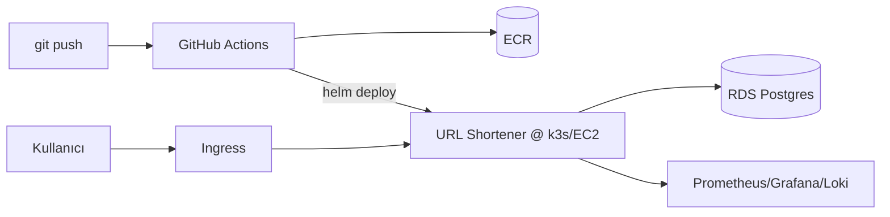

<!--
  ⚠️ BU DOSYA SİZİN PORTFOLYO README'NİZDİR — capstone bitince bunu paylaşacaksınız.
  Aşağıdaki [KÖŞELİ] alanları kendinize göre doldurun, örnekleri güncelleyin,
  ekran görüntülerini ekleyin. Amaç: birinin repoya girince "vay" demesi.
  Capstone'u NASIL yapacağınız: docs/capstone-rehberi.md + milestones/
-->

# 🔗 Cloud-Native URL Shortener

Küçük bir URL kısaltıcının **uçtan uca DevOps hattıyla** AWS'de çalıştırılması: CI/CD ile
build, Terraform ile altyapı, k3s (Kubernetes) ile deploy, Prometheus/Grafana/Loki ile izleme.

> Bir DevOps stajının capstone projesi — 6 haftalık öğrenimin tek çatı altında birleşimi.


**🌐 Canlı:** `[canlı URL — teardown öncesi]`  ·  **👤 Yapan:** [Ahmet Can Bezikoğlu](https://github.com/Ahmet1747)

---

## ✨ Özellikler
- `POST /shorten` ile uzun URL → kısa kod; `GET /{code}` ile yönlendirme
- Postgres (AWS RDS) ile kalıcı depolama
- `/health` (probe) + `/metrics` (Prometheus) + basit web arayüzü
- **Tam otomatik CI/CD**: push → test → image → ECR → deploy
- **Kod olarak altyapı** (Terraform) ve **izlenebilirlik** (Grafana dashboard + alert)

## 🏗️ Mimari
> Diyagram: [docs/mimari.md](docs/mimari.md)



## 🧰 Tech Stack
Python (FastAPI) · Docker · GitHub Actions · AWS (ECR, EC2, RDS) · Terraform · k3s + Helm ·
Prometheus · Grafana · Loki

## 🚀 Nasıl Çalışır (özet)
1. `git push` → GitHub Actions testleri çalıştırır, Docker image build edip **ECR**'a push eder.
2. **Terraform** AWS altyapısını (EC2+k3s, RDS) kurar.
3. **Helm** uygulamayı k3s'e deploy eder; **Ingress** ile public URL açılır.
4. **Prometheus/Grafana/Loki** metrikleri ve logları toplar; alarm kuralları uyarır.


## 📸 Ekran Görüntüleri
> `docs/screenshots/` altına ekleyin ve buraya gömün.
- Çalışan uygulama: ``
- Grafana dashboard: ``
- Yeşil CI/CD pipeline: ``

## 📚 Ne Öğrendim
- [ ] [Kendi cümlenizle 3-5 madde: en zorlandığınız/öğrendiğiniz şeyler]
- Bir uygulamayı baştan sona kadar canlıya alma süreçlerini öğrendim.
- Altyapının manuel kurulum yerine Terraform ile kod olarak (IaC) tasarlanıp yönetilmesini öğrendim; böylece tekrarlanabilir, versiyonlanabilir ve hatasız bir ortam kurmanın mümkün olduğunu bizzat deneyimledim.
- CI/CD pipeline tasarlamayı ve uygulamadaki her değişikliğin test, build ve deployment aşamalarından geçerek otomatik biçimde canlı ortama yansıtılmasını öğrendim. 
- DevOps sürecinde güvenliğin ayrı bir adım değil, geliştirme sürecinin her anına entegre edilmesi gereken bir düşünce biçimi olduğunu öğrendim.

## ⚙️ Yerel Geliştirme
```bash
# uygulamayı local çalıştır
docker compose up   # veya: uvicorn app.main:app --reload
```

---

*Bu proje bir eğitim/capstone çalışmasıdır. Altyapı maliyet nedeniyle demo sonrası kapatılmıştır
(`terraform destroy`); ekran görüntüleri ve kod referans içindir.*
