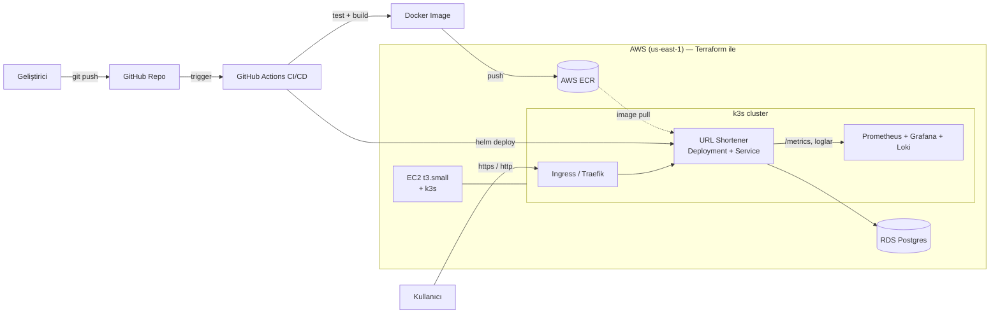

# 🏗️ Mimari

Projenin uçtan uca mimarisi. (Bu diyagramı README'nize de gömün; GitHub mermaid'i render eder.)

## Uçtan uca akış (kod → canlı)

## Katmanlar
| Katman | Teknoloji | Hafta |
|--------|-----------|-------|
| Uygulama | Python / FastAPI + Postgres | (yeni) |
| Konteyner | Docker | 2 |
| Registry | AWS ECR | 2 |
| CI/CD | GitHub Actions | 3 |
| Altyapı (IaC) | Terraform (EC2, SG, RDS) | 3 |
| Orkestrasyon | k3s (hafif Kubernetes) + Helm | 4 |
| Erişim | Ingress (Traefik) | 4 |
| Observability | Prometheus + Grafana + Loki | 5 |

> Not: EKS yerine **k3s** (EC2 üzerinde) seçildi — gerçek k8s deneyimi, EKS maliyeti olmadan.

## Diyagram (Özet)

Kullanıcı bir URL kısaltmak istediğinde istek önce Ingress (Traefik) karşılar
ve uygulamaya yönlendirir. Uygulama kısa kodu üretip RDS Postgres veritabanına kaydeder.

Sistemin kurulması ve çalışması için şu zincir devreye girer:
1. Kodu GitHub'a push ettiğimde GitHub Actions testleri otomatik çalıştırır.
2. Testler geçerse Docker imajını build edip AWS ECR'a gönderir.
3. Terraform, AWS'deki EC2 (k3s için) ve RDS veritabanını kod olarak kurar.
4. Helm, uygulamayı k3s'e deploy eder ve Ingress ile dış dünyaya açar.
5. Prometheus + Grafana + Loki sistemin metriklerini, dashboardlarını ve loglarını izler.

EKS yerine k3s seçilmesinin sebebi: gerçek Kubernetes deneyimi vermesi
ama EKS'in aylık maliyetini taşımaması.
